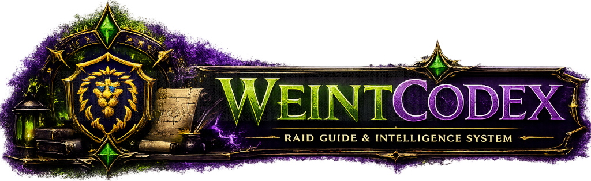

# WeintCodex — Forever Edition

<p align="center">
  
</p>

<p align="center">
  <strong>Das Gilden-Addon für World of Warcraft: Forever.</strong>
</p>

---

## Übersicht

**WeintCodex** ist das Ingame-Addon der Gilde: Schlachtzüge, Raidplanung,
deine Charaktere, der Gruppencheck vor dem Pull und die Gildenmaterialien —
an einem Ort, in einer Oberfläche.

Zusammen mit **WeintCompanion** (Desktop) und dem **WeintCodex Bot**
(Discord) bildet es ein geschlossenes Ökosystem: Anmeldungen aus Discord
stehen im Spiel, Termine wandern in den Gildenkalender, und die Installation
des Addons übernimmt die Companion.

## Was diese Fassung ist

Dies ist die Fassung für **World of Warcraft: Forever** (erscheint am
4. November 2026). Sie ist aus der Fassung für *Mists of Pandaria Classic*
hervorgegangen — durch **Wegnehmen, nicht durch Neubau**, genau wie
WeintCompanion 5.

* **Ohne Simmen, WeakAuras, Sockelsteine, Verzauberungen und Umschmieden.**
  Sie hingen alle an Zahlen aus Mists of Pandaria. Für Forever sagt keine
  davon etwas aus.
* **Neues Aussehen („Graphit"):** neutraler, kühler Grund, eine
  Serifenschrift für Überschriften, genau ein Akzent, der ausschliesslich
  Bedeutung trägt. Dasselbe Bild wie in WeintCompanion.
* **Alle neun Dungeons und alle drei Schlachtzüge sind drin** — mit
  Gebiet, Stufenbereich und einem eigenen Bereich für Tank, Heiler und
  Schaden.
* **Was nicht feststeht, steht auch nicht als feststehend da.** Die
  Bosslisten von Barrow Deeps und Hyjal Summit stammen aus dem
  Beta-Client und sind nicht bestätigt — sie sind überall als
  „vorläufig" ausgewiesen. Zu Onyxias Hort und zu den Dungeonbossen
  liegt nichts vor; dort sagt das Addon „noch nicht bekannt" statt
  etwas zu erfinden.

Die alte Fassung (`daddler/WeintCodex`) läuft für Mists of Pandaria Classic
weiter und behält ihren eigenen Update-Kanal.

---

## Funktionen

| Bereich | Was es beantwortet |
|---|---|
| **Übersicht** | Was steht beim Leveln an? Stufe und Erfahrung, was beim Lehrer noch nicht gelernt ist (und ob das Gold reicht), offene Ausrüstung, Dungeons für deine Stufe. |
| **Charakter** | Was angelegt ist — und welche deiner Charaktere der Bot kennen soll. |
| **Lehrer** | Was dein Klassenlehrer jetzt lehrt, was bald kommt, was es kostet — mit Rechnung gegen dein Gold — und wo du Waffen lernst. Dazu die **Klassenquests**: welche Quest einen Zauber lehrt, was du schon erledigt hast, wo Geber und der nächste Klassenlehrer stehen. |
| **Berufe** | Was du bei deiner Fertigkeit jetzt lernen kannst, was dir noch Punkte bringt, was neu in Forever ist — mit Reagenzien und dem nächsten Berufslehrer auf der Karte. |
| **Dungeons** | Alle Instanzen, mit Gebiet und Stufenbereich, Eingang auf der Karte, Quests mit Vor- und Folgequest, Beute. Passt meine Stufe? Wie ist die Gruppe aufzustellen? |
| **Gruppencheck** | Trägt jeder etwas auf jedem Platz? Ist etwas zerbrochen? Wie weit liegen die Stufen auseinander? |
| **Schlachtzüge** | Welche Instanzen es gibt, welche Bosse darin stehen, ob du eine gespeicherte ID trägst — und je Boss, was für Tank, Heiler und Schaden zu beachten ist. |
| **Anmeldung** | Wer hat sich für Mittwoch und Donnerstag eingetragen — mit Rolle, Klasse und Notiz. Wichtig, sobald geraidet wird. |
| **Kalender** | Der Termin, und für die Raidleitung die Ingame-Einladung. |
| **Materialien** | Was in der Gildenbank liegt. |
| **Companion** | Zustand der Brücke, in Klartext – und unter „Import“ der `WCIMPORT:`-Weg aus Discord. |
| **Einstellungen** | Fenster, Diagnose, Zugriffsprofil. |

---

## Installation

**Der empfohlene Weg ist WeintCompanion.** Sie lädt das Addon herunter,
prüft die Prüfsumme, legt vor jedem Update eine Sicherung an und installiert
es in den richtigen Ordner.

Von Hand geht es auch:

1. Das ZIP des neuesten [Releases](../../releases/latest) herunterladen.
2. Entpacken.
3. Den Ordner `WeintCodex` nach
   `World of Warcraft/_forever_/Interface/AddOns/` kopieren.

> Der Ordner **muss** `WeintCodex` heissen. Die Medienpfade im Addon sind
> darauf absolut verdrahtet — WoW kennt keine relativen Texturpfade.

Im Spiel öffnet `/wc` das Fenster.

---

## Befehle

| Befehl | Wirkung |
|---|---|
| `/wc` | Fenster öffnen und schliessen |
| `/wc tour` | Die Einführung erneut ansehen |
| `/wc gruppe` · `/wc gruppe prüfen` | Gruppencheck öffnen bzw. sofort durchlaufen |
| `/wc raids` · `/wc dungeons` · `/wc anmeldung` · `/wc kalender` | direkt zum Bereich |
| `/wc charakter` · `/wc materialien` · `/wc companion` | direkt zum Bereich |
| `/wc import` | Import (Reiter unter Companion) |
| `/wc einstellungen` | Einstellungen |
| `/wc access` | Das eigene Zugriffsprofil, mit jeder Freigabe |
| `/wc kalender prüfen` | Kalender-Diagnose im Chat |

Jeder dieser Befehle hat eine Entsprechung in der Oberfläche. Der Befehl ist
der schnelle Weg mitten in der Aufstellung, nicht die einzige Bedienung.

---

## Entwicklung

Kein Build-Schritt, kein Paketmanager — reines WoW-Addon-Lua, vom Client
direkt geladen. Geprüft wird kopflos:

```bash
luac5.1 -p $(find core data modules -name '*.lua')   # Syntax
lua5.1 .github/tests/load_test.lua .                 # lädt das Addon wirklich?
lua5.1 .github/tests/data_test.lua .                 # Datentabellen und Fassungen
```

Beides läuft in der CI bei jedem Push. Näheres in
[`.github/tests/README.md`](.github/tests/README.md) und
[`docs/development/releases.md`](docs/development/releases.md).

---

## Verwandte Projekte

* 🖥️ **WeintCompanion** (`daddler/Companion-Forever`) — Desktop-Anwendung,
  und der verbindliche Ort für jeden geteilten Datenvertrag.
* 🤖 **WeintCodex Bot** — Discord-Bot.
* 📦 **WeintCodex für Mists of Pandaria Classic** (`daddler/WeintCodex`) —
  die Vorgängerfassung, weiterhin gepflegt.
